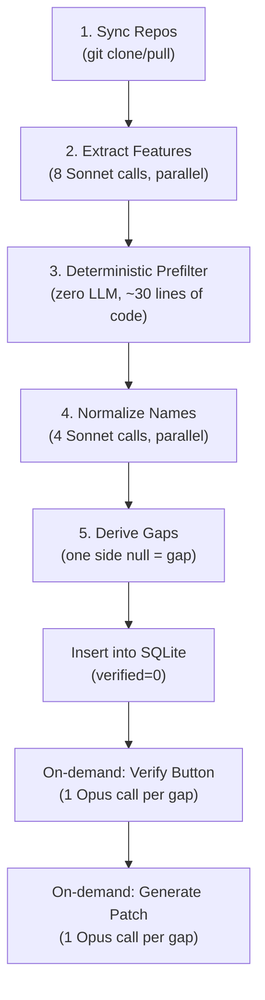

# Agent Control Center — Complete Technical Deep-Dive

> **Purpose**: Presentation prep for a 90-member senior engineering team. This document covers *everything* about how the project works — architecture, LLM design decisions, internal workings, and anticipated Q&A.

---

## 1. What Problem Does This Solve?

Juspay maintains **two payment SDKs** for the same product (Hyperswitch):

| SDK | Language | Platform | Repo |
|-----|----------|----------|------|
| **hyperswitch-web** | ReScript + React | Web browsers | `juspay/hyperswitch-web` |
| **hyperswitch-client-core** | ReScript + React Native | iOS & Android | `juspay/hyperswitch-client-core` |

Both repos were developed independently. Features added to one SDK sometimes never make it to the other. Finding these gaps manually means reading **thousands of lines of ReScript** across both repos.

**This dashboard automates that** — it detects feature gaps, verifies them with AI, generates patches to fill them, and provides 5 additional AI "skill" agents for day-to-day SDK development work.

---

## 2. High-Level Architecture

```
┌──────────────────────────────────────────────────────────────────┐
│                     Browser (React + Vite)                       │
│   Tab-based UI: Gap Analysis │ Patch │ Add Prop │ Translator     │
│                  Test Writer │ PR Review │ Docs │ History         │
│                     Vite Dev Server (:5173)                      │
│                     Proxies /api → :5174                         │
└────────────────────────────┬─────────────────────────────────────┘
                             │ HTTP (REST + NDJSON streaming)
                             ▼
┌──────────────────────────────────────────────────────────────────┐
│                 Node.js + Express Server (:5174)                 │
│                                                                  │
│  ┌─────────────┐  ┌──────────────┐  ┌────────────────────────┐  │
│  │  11 Routes  │  │  7 Skills    │  │  Analyzer Pipeline     │  │
│  │  (Express)  │  │  (AI agents) │  │  (Extract→Filter→      │  │
│  │             │  │              │  │   Normalize→Derive)    │  │
│  └──────┬──────┘  └──────┬───────┘  └──────────┬─────────────┘  │
│         │                │                      │                │
│  ┌──────▼──────────────────────────────────────────────────────┐ │
│  │                    LLM Layer (llm.ts)                       │ │
│  │  Spawns `claude -p` subprocess per LLM call                │ │
│  │  Uses Claude CLI login (Max plan) — NO API key             │ │
│  │  Two functions: ask() (blocking) + askStream() (NDJSON)    │ │
│  │  Tracks all child processes for cancel support             │ │
│  └──────┬──────────────────────────────────────────────────────┘ │
│         │ subprocess                                             │
│  ┌──────▼──────┐  ┌──────────────┐  ┌────────────────────────┐  │
│  │  SQLite DB  │  │  SHA Cache   │  │  Git Workspace         │  │
│  │  data/app.db│  │  data/cache/ │  │  workspace/            │  │
│  └─────────────┘  └──────────────┘  └────────────────────────┘  │
└──────────────────────────────────────────────────────────────────┘
```

### Tech Stack

| Layer | Technology | Why |
|-------|-----------|-----|
| Frontend | React + Vite + Tailwind CSS | Fast dev, HMR, good DX |
| Backend | Node.js + Express + TypeScript | Simple, typed, subprocess-friendly |
| Database | SQLite (better-sqlite3) | Zero config, local file, synchronous reads |
| Git ops | simple-git | Clone, pull, branch, diff — all from JS |
| AI | Claude CLI (`claude -p`) | No API key needed, uses Max plan subscription |
| Caching | SHA-keyed JSON files on disk | Same commits = zero AI calls |

---

## 3. The LLM Layer — How AI Is Wired

> [!IMPORTANT]
> This is the core innovation. The project does NOT use the Anthropic API SDK. It shells out to the **Claude CLI** (`claude -p`) as a subprocess.

### 3.1 Why Claude CLI Instead of the API?

```
❌ Traditional approach:
   npm install @anthropic-ai/sdk
   const client = new Anthropic({ apiKey: process.env.ANTHROPIC_API_KEY })
   → Requires API key, per-token billing, credential management

✅ This project's approach:
   spawn("claude", ["-p", "--model", "opus", "--output-format", "text"])
   → Uses the logged-in Claude Max plan session
   → No API key, no environment variable, no credentials
   → Bills against the existing subscription, not API credits
```

The team already has a **Claude Max plan subscription**. Using the CLI means:
- Zero credential management on a shared machine
- No `ANTHROPIC_API_KEY` anywhere
- No per-token billing — flat subscription cost
- The `claude` CLI handles authentication via `~/.claude` session

### 3.2 The Two Core Functions in `llm.ts`

#### `ask()` — Blocking call, returns final text

```typescript
// Spawns: claude -p --model <model> --output-format text --no-session-persistence
// Optionally: --allowed-tools "Read Grep Glob Edit Write Bash"
//             --permission-mode bypassPermissions
//             --append-system-prompt "<system>"

export function ask(prompt: string, opts: AskOptions): Promise<string>
```

**How it works internally:**
1. Builds CLI args from options (model, tools, system prompt, cwd)
2. `spawn("claude", args)` — creates a child process
3. Pipes the prompt into `stdin`, closes stdin
4. Collects `stdout` chunks into a string
5. On process exit with code 0 → resolves with the text
6. On timeout → `SIGKILL` the process, reject
7. Tracks every child in `activeChildren` set for cancel support

#### `askStream()` — Streaming call, emits chunks via callback

```typescript
// Spawns: claude -p --model <model> --output-format stream-json --verbose
export function askStream(
  prompt: string,
  opts: AskOptions,
  onChunk: (chunk: StreamChunk) => void
): Promise<void>
```

**How it works internally:**
1. Same subprocess spawn, but with `--output-format stream-json --verbose`
2. `stdout` emits NDJSON lines (one JSON object per line)
3. Each line is parsed and mapped to our own `StreamChunk` type:
   - `type: "text"` — assistant text delta
   - `type: "tool_use"` — agent is calling Read/Grep/Edit/etc.
   - `type: "tool_result"` — result of a tool call
   - `type: "done"` — stream complete
4. The `onChunk` callback is invoked for each chunk, which the Express route forwards as NDJSON to the browser

#### `askJson()` — Blocking call, parses JSON from response

```typescript
export async function askJson<T>(prompt: string, opts): Promise<T>
```

Calls `ask()`, then extracts JSON using two strategies:
1. **Fenced block extraction**: looks for `` ```json ... ``` ``
2. **Balanced-brace extraction**: walks from the first `{` or `[` to its matching closer, tracking quote escaping and nesting depth

This dual strategy handles the common case where the model wraps JSON in markdown fences or adds prose before/after the JSON.

### 3.3 Model Tiering Strategy

> [!TIP]
> This is a key design decision worth explaining in the demo. Different tasks get different models based on cost/capability tradeoffs.

| Tier | Model | Tools Given | Purpose | When Used |
|------|-------|-------------|---------|-----------|
| **Cheap bulk** | Sonnet | None | Text analysis, pattern matching | Extract features, normalize names, convention review, documentation |
| **Expensive precision** | Opus | Read, Grep, Glob | Verify claims by searching code | Validate gaps, back-translate checks |
| **Expensive creative** | Opus | Read, Grep, Glob, Edit, Write, Bash | Write code, generate patches | Patch generation, add prop, write tests |

**Why two models?**
- Sonnet is ~5x cheaper and ~3x faster — perfect for bulk extraction where you don't need deep reasoning
- Opus is the most capable model — needed only when the agent must *actually search code* or *write code*
- Using Opus for everything would cost 10x more tokens for the same job

### 3.4 Tool Access — How Claude Gets Filesystem Access

When `allowedTools` is specified, the CLI launches with:
```
--allowed-tools "Read Grep Glob Edit Write Bash"
--permission-mode bypassPermissions
```

The `cwd` option sets the working directory so relative paths resolve to the target repo.

| Tool | What It Does | Which Agents Use It |
|------|-------------|---------------------|
| `Read` | Read a file's contents | Verify, Patch, Props, Tests, Review |
| `Grep` | Search file contents by pattern | Verify, Patch, Props, Tests, Review |
| `Glob` | Find files by name pattern | Verify, Patch, Props, Tests |
| `Edit` | Modify existing files | Patch, Props, Tests |
| `Write` | Create new files | Patch, Props, Tests |
| `Bash` | Run shell commands | Patch, Props, Tests (for `npm run re:build`) |

### 3.5 Process Management

Every `spawn()` call registers the child process in `activeChildren: Set<ChildProcess>`. This enables:
- **Cancel button**: `killAllSubprocesses()` sends `SIGKILL` to all tracked children
- **Timeout enforcement**: Each call has a `setTimeout` that kills the process if it exceeds the budget
- **Clean shutdown**: Server shutdown kills any lingering processes

---

## 4. The Gap Analysis Pipeline (5 Stages)

This is the core feature — detecting what's in one SDK but missing in the other.

### Pipeline Flow



### Stage 1: Sync Repos

```typescript
const repos = await syncAllRepos();
// Clones or pulls both repos into workspace/
// Returns { web: { sha: "abc123" }, mobile: { sha: "def456" } }
```

Uses `simple-git` to clone/pull both repos. The SHA of each repo's HEAD is captured and used as the cache key for all downstream stages.

### Stage 2: Extract Features (8 Sonnet calls, parallel)

**4 categories × 2 repos = 8 parallel calls**:

| Category | What It Extracts |
|----------|-----------------|
| `payment_method` | Payment method names (Klarna, SEPA, ACH, etc.) |
| `config` | Integrator-facing configuration props |
| `component` | UI components (PaymentSheet, CardForm, etc.) |
| `backend_api` | Backend API endpoints called by the SDK |

Each extractor:
1. Reads relevant source files from disk (not via Claude — the server reads them)
2. Passes file contents to Sonnet via `askJson()`
3. Sonnet returns `[{name, file, snippet}]` — a list of features found

**Caching**: Results are cached to `data/cache/extract/<repo>/<sha>/<category>.json`. Same git commit = zero calls. This is the single most impactful optimization — re-running gap analysis on unchanged repos costs *exactly zero tokens*.

### Stage 3: Deterministic Prefilter (zero LLM calls)

> [!TIP]
> This is the critical "aha" moment for the audience. ~60% of noise is removed by 30 lines of filter code — no AI needed.

The filter runs AFTER the cache (so tuning rules never invalidates cached extract data). Two passes:

**Pass 3a — Canonical Group Collapse (config category)**:
```
appearance_theme      ┐
appearance_variables  │
color_primary         ├── All become ONE entry: "appearance_api"
color_background      │
font_family           │
shapes_border_radius  ┘
```

Both SDKs have appearance APIs, but web exposes them as a structured object while mobile flattens them to dozens of `color_*` keys. Without collapsing, every sub-key looks like a separate gap.

**5 canonical groups defined**: `appearance_api`, `layout_config`, `wallets_ui_config`, `billing_fields_config`, `saved_payment_methods_config`

**Pass 3b — Noise Denylist**:
- **Component noise** (18 items): `tab_bar`, `button_element`, `checkout_view`, `blik_code_input`, etc. — infrastructure primitives, not integrator features
- **Config noise** (12 items): `element_classes`, `icon_style`, `placeholder_*`, `confirm_params_*` — low-level styling, not features

**Pass 3c — Structural False Positive Rule**:
```typescript
// Mobile SDK loads payment methods dynamically from backend responses.
// Static extraction will NEVER find payment method names in mobile source.
// Every web payment method always looks "missing in mobile" = always false positive.
if (category === "payment_method" && missingIn === "mobile") return true; // DROP
```

**Impact measured against real data**:

| Stage | Features | Naive Gaps |
|-------|----------|------------|
| Raw extraction | 256 | 203 |
| After prefilter | 143 | 81 |
| **Reduction** | **44%** | **60%** |

### Stage 4: Normalize Names (4 Sonnet calls)

Each category gets one Sonnet call that receives the web list and mobile list side-by-side.

**Purpose**: Map naming variants across repos:
- `card_holder_name` (web) ↔ `cardHolder` (mobile)
- `saved_payment_methods` ↔ `saved_payment_method` (singular vs plural)
- `payment_methods_header_text` ↔ `payment_sheet_header_text`

**Output**: `[{canonical_name, web: Feature|null, mobile: Feature|null}]`

Where `web = null` → missing in web; `mobile = null` → missing in mobile.

**Fallback**: If the LLM normalize call fails, there's a `naivePairs()` function that does pure string-normalization matching (`toLowerCase().replace(/[^a-z0-9]/g, "")`).

**Caching**: Results cached by both SHAs — `data/cache/normalize/<category>/<webSHA>_<mobileSHA>.json`

### Stage 5: Derive Gaps

Simple loop: for each canonical feature, if one side is null, it's a gap. Gaps are inserted into SQLite with `verified=0`.

**Smart insert**: Previously verified gaps (from earlier runs) carry forward their verdict, so you don't re-verify the same gap after a re-run.

**Dismissed gaps**: False positives confirmed by Opus are stored in a `dismissed_gaps` table and automatically skipped on future runs — you never waste tokens re-verifying a known false positive.

---

## 5. The 7 AI Agents — In Depth

### Agent 1: Verify Agent (On-demand, Opus + Read/Grep/Glob)

**Trigger**: User clicks "Verify" button on a gap row

**What happens**:
1. Server sends Opus into the *missing* repo with Read/Grep/Glob tools
2. Opus actually searches the codebase for the feature under its name and any plausible alias
3. Returns one of three verdicts:
   - `confirmed` → feature is genuinely absent → green "verified" badge
   - `false_positive` → found it under another name → row auto-deleted
   - `platform_specific` → can't exist on that platform → dimmed row

**Prompt structure**:
```
"Feature 'click_to_pay' is claimed missing from this repo.
 USE your tools to actually look. Search under that name and
 any plausible alias. Report: confirmed / false_positive / platform_specific."
```

**Cached by repo SHA** — verify once at a given commit, free forever at that commit.

### Agent 2: Patch Agent (On-demand, Opus + Full toolkit)

**Trigger**: User clicks "Generate Patch" on a verified gap

> [!IMPORTANT]
> This is the most sophisticated agent. It went through 3 major iterations to get right.

**Two-phase prompt design** (Iteration 7 breakthrough):

**Phase 1 — Source Analysis**: Agent is given both `sourceDir` (where the feature exists) and `targetDir` (where it's missing). First, it uses Read/Grep/Glob with absolute paths on `sourceDir` to understand:
- The type declaration
- The config parser
- State threading pattern
- Rendering component

**Phase 2 — Implementation**: Using what Phase 1 revealed, implement the equivalent pattern in `targetDir` following the target repo's conventions.

**Self-verification loop**: After every meaningful edit, the agent runs `npm run re:build` via the Bash tool. If it fails, it reads all errors, finds the root cause, fixes it, and re-runs. No attempt limit — uses the full time budget.

**Post-patch flow**:
1. Capture git diff (submodule-aware)
2. Server-side build verification (safety net)
3. Commit on feature branch
4. Push to bot fork (`pradeep120230-creator/sdk-agent-*`)
5. Open PR against `juspay/*` upstream

**Streaming**: The browser shows real-time tool-call chips (Read/Grep in Phase 1, Edit/Write in Phase 2, Bash for builds) via NDJSON streaming.

### Agent 3: Add Prop (Opus, per-platform)

**Trigger**: User fills out a prop spec form (name, type, default, behavior, platforms)

**What it does**: Adds a new integrator-facing configuration prop to BOTH SDKs in one click.

**Per-platform agents** (up to 4 Opus calls):

| Platform | Prompt Template | Pattern Files Read |
|----------|----------------|-------------------|
| `web` | `buildWebPrompt()` | `PaymentType.res`, `DynamicFieldsUtils.res`, `DynamicFields.res` |
| `mobile` | `buildMobilePrompt()` | `SdkTypes.res`, `NativeSdkPropsKeys.res`, `DynamicFieldsContext.res` |
| `android_native` | `buildAndroidPrompt()` | `PaymentSheet.kt`, `LaunchOptions.kt` |
| `ios_native` | `buildIosPrompt()` | `PaymentSheetConfiguration.swift` |

**Key technique**: Each prompt includes **real pattern files** from the target repo (up to 12KB each) so the agent knows exactly how props are wired. The prompt says "FOLLOW THIS PATTERN EXACTLY" — no guessing.

**Flow for mobile**: All mobile platforms (ReScript + Android Kotlin + iOS Swift) share one git branch. The agents run sequentially on the same repo dir, each editing their own layer. Then one submodule-aware commit captures everything.

**Build verification**: After all edits, runs `npm run re:build` and rejects if it fails.

### Agent 4: Translator (Opus for translation, Sonnet for back-translation)

**Trigger**: User provides a key name, English value, and context

**3-phase flow**:

**Phase 1 — Translate** (1 Opus call):
```
"Translate this UI string into 31 languages. Return a flat JSON object."
```
→ Returns `{ "de": "...", "fr": "...", "ja": "...", ... }`

**Phase 1b — Deterministic Quality Checks** (zero tokens):
The `validateTranslations()` function checks for:
- Empty translations → **blocking** (won't write to disk)
- English text leaked into non-English locale → warning
- String >250% of English length → warning (UI overflow risk)
- Missing `{placeholder}` tokens → warning

**Phase 1c — Back-translation spot-check** (1 Sonnet call, parallel with Phase 2):
Back-translates 5 key languages (de, fr, ja, ar, es) to English and checks for semantic drift.

**Phase 2 — Surgical File Insertion** (zero LLM, parallel both repos):
```typescript
// Pure string manipulation — no reformatting
// Exactly +1 line per locale file (new key at end)
// Previous last key gains a comma — unavoidable JSON syntax
// ZERO existing keys touched
insertKeyIntoLocaleFile(filePath, keyName, value)
```

This runs on all **32 locale files** in both repos. Total: 64 file writes, zero LLM calls for the writes themselves.

### Agent 5: Test Writer (Opus + Bash)

**Trigger**: User provides a branch/PR URL, repo target, and feature description

**Per-repo agents**:

| Target | Framework | Pattern Files Read |
|--------|-----------|-------------------|
| Web | Cypress | `sdk-initialization-test.cy.ts`, `utils.ts`, `commands.ts`, `cards.ts` |
| Mobile | Detox (Jest) | `card-validation-e2e.test.ts`, `DetoxHelpers.ts`, `Constants.ts`, `APIUtils.ts` |

**What makes this effective**:
1. Fetches the **actual PR diff** first (supports both branch names and GitHub PR URLs like `https://github.com/juspay/hyperswitch-web/pull/420`)
2. Embeds **4 existing test pattern files** in the prompt so the agent matches the repo's exact test style
3. Requires coverage of: happy path, validation errors, failure paths (declined, network error), edge cases
4. **Post-generation validation** (zero tokens):
   - File exists on disk?
   - Contains `describe()` block?
   - Contains `it()` or `test()` blocks?
   - Has assertions (`should()` for Cypress, `expect()` for Detox)?
   - No hardcoded credentials?
   - Framework-specific: `cy.` commands for Cypress, `device.`/`element()` for Detox

### Agent 6: PR Reviewer (3 parallel passes)

**Trigger**: User provides a branch/PR URL and repo target

> [!IMPORTANT]
> This agent uses a **multi-pass architecture** — three focused reviewers instead of one general-purpose reviewer. This is a key LLM architecture decision.

#### The Three Passes (run in `Promise.all`):

| Pass | Focus | Model | Tools | Why Separate |
|------|-------|-------|-------|-------------|
| **Security** | PCI, credential exposure, 3DS integrity, amount mutation | Opus | Read, Grep | Security issues need deep reasoning + code context |
| **Logic** | Null safety, async races, error propagation, edge states | Opus | Read, Grep | Logic bugs need surrounding file context |
| **Convention** | Naming, file placement, test coverage, i18n coverage | Sonnet | None | Pattern matching doesn't need deep reasoning |

**Why this beats a single prompt**: A single prompt asking for security + logic + patterns simultaneously causes the model to "spread thin" across 7 dimensions. The security pass finds PCI issues the combined prompt missed because it wasn't distracted by counting test coverage. Separation of concerns applies to LLM prompts just as much as to code.

#### Post-LLM Deterministic Pipeline:

After all 3 passes return, four deterministic validators run (zero tokens):

1. **`filterHallucinatedFilePaths()`**: Drops findings that cite files not present in the diff. This is the #1 LLM failure mode in review — inventing plausible-looking paths for issues it "knows about" but which aren't in this PR.

2. **`deduplicateIssues()`**: Merges findings from multiple passes by `category + first 80 chars of message`. Higher severity wins on conflict.

3. **`computeVerdict()`**: **Ignores the model's stated verdict entirely.** Models have a strong bias toward approving PRs even when they list blocking issues. This function derives the verdict mechanically:
   - Any `blocking` issue → `request_changes`
   - Only `suggestion` → `comment`
   - Nothing / `nitpick` only → `approve`

4. **`buildReviewSummary()`**: Templated summary from facts — no extra LLM call, always accurate.

### Agent 7: Documentation Generator (Sonnet, fire-and-forget)

**Trigger**: Automatically after any successful skill run

Produces **two markdown bodies**:
1. **Internal dev notes**: What it does / How it was implemented / Configuration / Testing notes
2. **Official GitBook copy**: Publish-ready markdown matching [docs.hyperswitch.io](https://docs.hyperswitch.io) voice and structure

The official copy is generated by `buildOfficialPrompt()` which includes:
- Do/don't style rules derived from the live docs
- A markdown skeleton
- A concrete before/after few-shot modeled on the `showCardBrand` property

**Skip list**: `tests` and `review` skills don't get official docs (scaffolding, not public API).

---

## 6. Deterministic Validators — The "Trust Layer"

> [!IMPORTANT]
> This is a key architectural principle: **deterministic before LLM**. Every LLM output passes through zero-token validators before reaching the user.

```
LLM Output → filterHallucinatedFilePaths()  (review)
           → computeVerdict()               (review)
           → deduplicateIssues()            (review)
           → parseDiffStats()               (review)
           → buildReviewSummary()           (review)
           → validateTranslations()         (translator)
           → validateGeneratedTests()       (test writer)
```

The principle: **the #1 source of agent mistakes is not bad reasoning — it's hallucinated file paths, leaked placeholder values, and empty outputs.** Catching these with pure logic means the user never sees a bad result.

---

## 7. Caching Architecture

### Three Cache Layers

| Cache | Key | What's Cached | Effect |
|-------|-----|--------------|--------|
| **Extract cache** | `{repo}/{sha}/{category}` | Raw extractor output per category per repo | Re-run with same commit = zero extract calls |
| **Normalize cache** | `{category}/{webSHA}_{mobileSHA}` | Normalized feature list per category | Re-run with same commits = zero normalize calls |
| **Validate cache** | `{repo}/{sha}/{gapName}` | Verify verdict per gap | Re-verify at same commit = free |

### On-Disk Structure

```
data/cache/
├── extract/
│   ├── web/
│   │   └── abc123/
│   │       ├── payment_method.json
│   │       ├── config.json
│   │       ├── component.json
│   │       └── backend_api.json
│   └── mobile/
│       └── def456/
│           └── ...
├── normalize/
│   └── config/
│       └── abc123_def456.json
└── validate/
    └── mobile/
        └── def456/
            └── click_to_pay.json
```

**Impact**: A demo re-run costs exactly 0 tokens. A run after a single commit change in one repo costs 4 extract calls (only the changed repo) + 4 normalize calls = 8 Sonnet calls instead of 12.

---

## 8. Database Schema (SQLite)

```sql
reports         -- Gap analysis runs (id, created_at, web_sha, mobile_sha, status)
gaps            -- Individual gaps (id, report_id, category, canonical_name, 
                --   missing_in, present_in, evidence, rationale, severity,
                --   platform_specific, verified)
dismissed_gaps  -- False positives that survive across SHA changes
patches         -- Generated patches (diff_path, branch, summary, pr_url, pr_number)
skill_runs      -- History of all skill executions (skill_id, status, input_json, result_json)
reviews         -- PR review history (branch, verdict, result_json)
docs            -- Auto-generated documentation (content, official_content)
```

---

## 9. Key Design Decisions & Their Rationale

### Q: Why Claude CLI instead of the API?
**A**: No API key management needed. The team's Max plan subscription covers everything. On a shared machine, this means zero credential management — no `.env` files, no secrets rotation, no per-user API key provisioning.

### Q: Why lazy verification instead of verifying everything upfront?
**A**: Iteration 1 validated all ~240 gaps upfront with Opus. It took **11 minutes** and burned massive tokens. Most gaps are never acted on. Lazy verification means you only pay for the gaps you care about. Dropped from 11 minutes to <1 minute.

### Q: Why deterministic filters instead of smarter LLM prompts?
**A**: Through 7 iterations, we learned that ~60% of "gaps" were structural noise — appearance sub-keys listed as separate features, generic UI primitives, platform-specific form inputs. A 30-line filter function eliminated them for free. Tuning filter rules takes milliseconds against cached data; tuning LLM prompts costs 1+ minute of API calls per attempt.

### Q: Why three separate review passes instead of one?
**A**: Focused prompts beat comprehensive prompts. The security pass finds security issues the combined prompt missed because it wasn't distracted by counting test coverage. Separation of concerns applies to LLM prompts just as much as to code.

### Q: Why is the verdict computed deterministically and not from the LLM?
**A**: Models have a strong approval bias. In testing, they would say "approve" even when listing blocking issues. Ignoring the model's verdict and computing it from issue severities produces a trustworthy result every time.

### Q: Why Bash access for the patch agent?
**A**: Without Bash, the agent edited blindly and the server checked the build after the fact. Every failed run wasted a full Opus context window. With Bash, the agent runs `npm run re:build` itself, reads errors, and iterates — drastically reducing failed patches.

### Q: Why two-phase prompts for patch generation?
**A**: Before Phase 1, the agent only saw a single truncated file (up to 8KB) from the source repo. For features spanning 4-6 files (type definitions + parsers + components), this was catastrophically insufficient. Phase 1 forces the agent to explore the source repo in depth before touching the target.

---

## 10. Token Economics

### Cold Run (first time, nothing cached)

| Stage | Calls | Model | Approx Time |
|-------|-------|-------|-------------|
| Extract | 8 parallel | Sonnet | ~20s |
| Normalize | 4 parallel | Sonnet | ~15s |
| **Total** | **12 calls** | **Sonnet** | **~1 min** |

### Cached Run (same commits)

| Stage | Calls | Time |
|-------|-------|------|
| Everything | 0 | **Instant** |

### Per-Gap Operations

| Operation | Calls | Model | Time |
|-----------|-------|-------|------|
| Verify | 1 | Opus | ~15s |
| Patch | 1 (streaming) | Opus | ~1-2 min |

### Per-Skill Operations

| Skill | Calls | Models |
|-------|-------|--------|
| Add Prop | 1-4 Opus (per platform) + 1-2 Sonnet (docs) | Opus + Sonnet |
| Translator | 1 Opus (translate) + 1 Sonnet (back-translate) + 1-2 Sonnet (docs) | Opus + Sonnet |
| Test Writer | 1 Opus per repo + 0 Sonnet (deterministic validation) | Opus |
| PR Reviewer | 2 Opus (security + logic) + 1 Sonnet (convention) | Opus + Sonnet |
| Documentation | 2 Sonnet (internal + official) | Sonnet |

---

## 11. Evolution History (7 Iterations)

| # | Date | What Changed | Result |
|---|------|-------------|--------|
| 1 | Apr 9 | Bulk Opus validation on every run | ❌ 11 min, too expensive |
| 2 | Apr 9 | Lazy per-gap validation | ⚠️ Fast but 240 noisy gaps shown |
| 3 | Apr 9 | Deterministic prefilter | ✅ 240 → 81 gaps, zero token cost |
| 4 | Apr 10 | Multi-pass PR review + validators | ✅ Focused passes > combined prompt |
| 5 | Apr 11 | Real PRs + Android preview + bot forks | ✅ End-to-end: gap → PR |
| 6 | Apr 11 | Agent self-verification (Bash) + build fix | ✅ Agent iterates on build errors |
| 7 | Apr 13 | Streaming + two-phase source analysis | ✅ Agent reads source repo first |

---

## 12. Anticipated Q&A for Senior Engineers

### Architecture Questions

**Q: Why not use a proper agent framework like LangChain or CrewAI?**
A: The project uses Claude's built-in tool calling via the CLI, which already provides an agent loop (think → tool call → observe → think). Adding LangChain would add abstraction without benefit since we only use one LLM provider. The subprocess approach is simpler, has fewer dependencies, and gives direct control over process lifecycle (cancel, timeout, streaming).

**Q: Why SQLite instead of Postgres/MySQL?**
A: This is a local-only tool on a shared machine. SQLite is zero-config, single-file, and `better-sqlite3` provides synchronous reads which simplifies the Express handlers. There's no multi-user concurrency to worry about.

**Q: How do you handle concurrent requests?**
A: The workspace layer uses an async mutex (`workspace/mutex.ts`) to ensure only one git operation happens at a time per repo. LLM calls are independent subprocesses — they can run concurrently. The database uses SQLite's built-in WAL mode for concurrent reads.

**Q: What happens if the Claude CLI isn't installed or the user isn't logged in?**
A: The `spawn("claude", ...)` call will fail with `failed to spawn claude: ENOENT`. The error propagates to the Express route and is shown in the UI. The README has setup instructions for `npm install -g @anthropic-ai/claude-code` and `claude login`.

### LLM Architecture Questions

**Q: How do you prevent hallucinations?**
A: Multiple layers:
1. **Tool access**: The verify agent doesn't guess — it actually searches the codebase with Grep/Read
2. **Deterministic validators**: `filterHallucinatedFilePaths()` drops review findings that cite files not in the diff
3. **Deterministic verdict**: Never trust the model's stated verdict — compute it from issue severities
4. **Build verification**: The patch agent must produce code that compiles — Bash tool runs the build
5. **Back-translation**: Translator does a reverse translation spot-check

**Q: What's the context window usage like?**
A: For extraction, we read relevant source files ourselves and pass them in the prompt (typically 20-40KB per call). For patch generation, we give the agent tool access so it can read files on demand rather than cramming everything into the prompt. The streaming two-phase approach (Iteration 7) means the agent builds its context incrementally.

**Q: Can this work with other LLMs (GPT-4, Gemini)?**
A: The LLM layer (`llm.ts`) is tightly coupled to the Claude CLI. However, the architecture is model-agnostic at the design level — prompts, validators, and caching would work with any sufficiently capable model. You'd need to rewrite `llm.ts` to call a different API. (Note: Iteration 4 in LEARNINGS.md mentions a brief migration to GitHub Models/GPT-4.1 — that path exists but was superseded.)

**Q: How do you handle rate limiting or quota issues?**
A: The Claude Max plan subscription handles this at the CLI level. The caching layer means most operations don't hit the LLM at all on re-runs. For bulk operations (8 parallel extract calls), we rely on the CLI's built-in queuing.

### Quality & Reliability Questions

**Q: How accurate is the gap detection?**
A: After the full pipeline (extract → prefilter → normalize → verify), precision is very high. The remaining false positives are caught by the per-gap Verify button (Opus + tools). The key insight is that most false positives are **structural** (e.g., mobile loads payment methods dynamically), not lexical — and those are caught by deterministic rules, not AI.

**Q: What happens if the patch agent generates bad code?**
A: Three safety layers:
1. The agent runs the build itself via Bash tool — iterates until green
2. Server-side build check after the agent finishes (safety net)
3. If both pass, the code is committed on a feature branch — never on main
4. A PR is opened for human review — the agent doesn't merge anything

**Q: How do you handle the mobile SDK's submodules?**
A: The mobile repo has 3 git submodules (`shared-code`, `android`, `ios`). The project has submodule-aware git operations throughout:
- `getDiffWithSubmodules()` captures diffs from both parent and submodules
- `commitWithSubmodules()` commits inside submodules first, then parent
- `pushSubmoduleToFork()` pushes each submodule to its own bot fork
- `.gitmodules` is rewritten to point at bot forks so the PR branch is buildable

### Process Questions

**Q: Can this be used in CI/CD?**
A: Currently it's a local dashboard, but the Express API is standard REST — you could call it from CI. The main constraint is the Claude CLI login (interactive OAuth), which would need a persistent session or API key migration.

**Q: What's the cost of running this?**
A: With a Claude Max plan ($100/month), there's no per-token cost. A full gap analysis costs ~12 Sonnet calls (~1 minute). Each patch costs 1 Opus call (~2 minutes). The caching layer means repeated operations are free.

**Q: Why not just use Claude Code directly?**
A: Claude Code is the underlying engine — this dashboard adds:
- A **curated pipeline** (extract → filter → normalize → verify) that individual Claude Code sessions can't replicate
- **Persistent state** (SQLite DB, cached results, skill history)
- **Deterministic quality gates** (validators that catch hallucinations)
- **A visual UI** for non-CLI users
- **Process management** (cancel, timeout, streaming)

---

## 13. Numbers to Cite During the Presentation

| Metric | Value |
|--------|-------|
| Raw features extracted | ~256 across both repos |
| After deterministic filter | ~143 features (44% reduction, zero tokens) |
| After normalization | ~75 candidate gaps |
| After structural FP removal | ~40-50 actionable gaps |
| Cold run time | ~1 minute (12 Sonnet calls) |
| Cached run time | **Instant** (0 calls) |
| Per-gap verification | ~15 seconds (1 Opus call) |
| Per-gap patch generation | ~1-2 minutes (1 Opus call, streaming) |
| Locale files translated per run | 64 (32 per repo × 2 repos) |
| Supported languages | 32 |
| Review passes (parallel) | 3 (security + logic + convention) |
| Filter code | ~30 lines (kills 60% of noise) |
| Total server source files | ~25 TypeScript files |
| Total lines of server code | ~4,000 lines |

---

## 14. What Each Demo Video Should Highlight

### Patch Demo
- Two-phase streaming (source analysis → implementation → build loop)
- Real-time tool-call chips in the UI
- The diff viewer showing actual code changes
- PR link at the end

### Preview Demo
- Web preview via iframe (localhost:9050)
- Mobile preview via adb screencap polling (2fps, zero dependencies)

### Add Prop Demo
- Single form → agents for web + mobile + Android + iOS
- Pattern files injected into prompts
- Build verification before commit
- PR opened in both repos

### Translator Demo
- One key → 32 languages in one Opus call
- Deterministic quality checks (empty, leaked English, overflow, placeholders)
- Back-translation spot-check
- Surgical JSON insertion (exactly +1 line per file)

### Test Writer Demo
- PR URL input → fetches actual diff
- Pattern files from existing tests embedded in prompt
- Cypress (web) or Detox (mobile) output
- Post-generation validation (describe blocks, assertions, no hardcoded creds)
